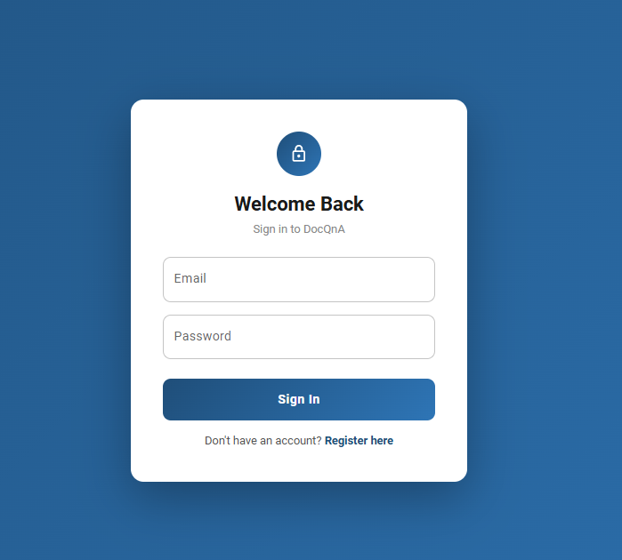
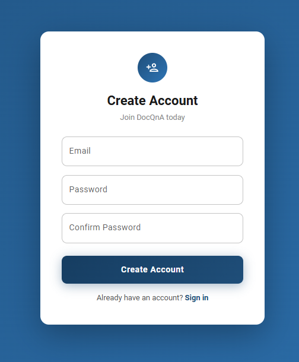
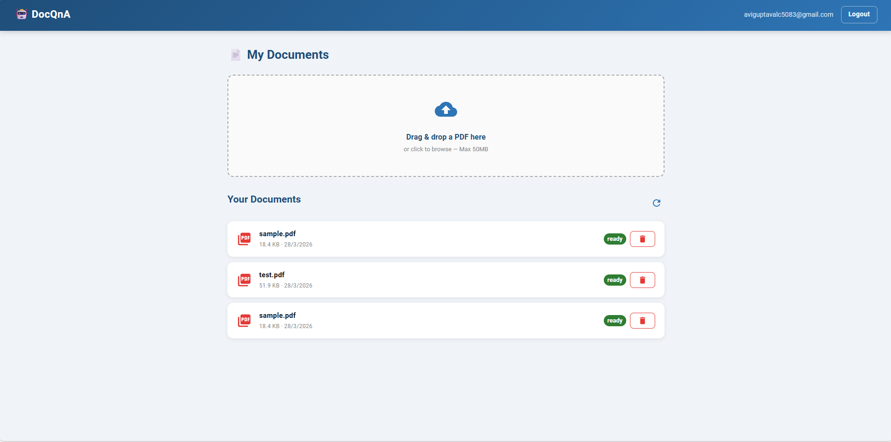

# 🤖 DocQnA — RAG-Based Document Q&A App

> Ask natural language questions over your uploaded PDF documents using AI — powered by Retrieval-Augmented Generation (RAG).


---

## ✨ Features

### ✅ Live Now
- 🔐 **JWT Authentication** — Register, login, logout with refresh token rotation
- 📄 **PDF Upload** — Drag and drop PDF documents with real-time status tracking
- 🧠 **Full RAG Pipeline** — Extract → Chunk → Embed → Store, fully automated
- 📊 **Document Management** — List, view status, and delete your documents
- 🔒 **User Isolation** — Every user's documents are completely private

### 🔲 Coming Soon
- 💬 **AI-Powered Q&A** — Ask questions, get answers grounded in your documents
- 🌊 **Streaming Responses** — Real-time token-by-token answer rendering
- 📚 **Source Attribution** — See exactly which chunk answered your question
- 🗂️ **Collection Management** — Group documents into named collections
- 📜 **Chat History** — Persistent conversation history per user

---

## 🖼️ Screenshots

### Login


### Register


### Dashboard — Document Upload & Management


> 📸 Q&A chat screenshots will be added in Week 2.

---

## 🏗️ Architecture

```
┌─────────────────────────────────────────────────────────┐
│                  React 18 + TypeScript                  │
│           MUI styled() · Zustand · Axios                │
└────────────────────────┬────────────────────────────────┘
                         │ HTTP / REST
┌────────────────────────▼────────────────────────────────┐
│              ASP.NET Core 8 Web API                     │
│         JWT Auth · EF Core · Serilog                    │
└──────┬──────────────────────────────┬───────────────────┘
       │                              │
┌──────▼──────┐               ┌───────▼───────┐
│  PostgreSQL │               │  RAG Pipeline │
│  (Metadata) │               │               │
│  · Users    │               │ PDF → Extract │
│  · Documents│               │     → Chunk   │
└─────────────┘               │     → Embed   │
                              │     → Store   │
                         ┌────▼────┐  ┌───────▼──────┐
                         │ Qdrant  │  │ NVIDIA NIM   │
                         │ Vectors │  │ Embeddings + │
                         │  DB     │  │ LLM (Llama)  │
                         └─────────┘  └──────────────┘
```

---

## 🛠️ Tech Stack

| Layer | Technology | Purpose |
|---|---|---|
| Frontend | React 18 + TypeScript | UI framework |
| Styling | MUI `styled()` utility | Component styling |
| State | Zustand | Global auth + document state |
| HTTP | Axios | API calls with JWT interceptor |
| Backend | ASP.NET Core 8 Web API | REST API |
| Auth | JWT Bearer + BCrypt | Secure authentication |
| ORM | EF Core 8 + PostgreSQL | Relational data storage |
| PDF Parsing | PdfPig | Text extraction from PDFs |
| Chunking | Custom sliding window | Semantic text splitting |
| Embeddings | NVIDIA NIM (`nvidia/nv-embedqa-e5-v5`) | 1024-dim vector embeddings |
| LLM | NVIDIA NIM (`meta/llama-4-maverick-17b-128e-instruct`) | Answer generation |
| Vector DB | Qdrant | Semantic similarity search |
| Logging | Serilog | Structured request logging |
| Infrastructure | Docker + Docker Compose | PostgreSQL + Qdrant containers |

---

## 🚀 Getting Started

### Prerequisites

| Tool | Version | Download |
|---|---|---|
| Node.js | 20 LTS | [nodejs.org](https://nodejs.org) |
| .NET SDK | 8.0 | [dot.net](https://dot.net) |
| Docker Desktop | Latest | [docker.com](https://docker.com/products/docker-desktop) |
| Git | Latest | [git-scm.com](https://git-scm.com) |
| NVIDIA NIM API Key | — | [build.nvidia.com](https://build.nvidia.com) |

---

### 1. Clone the Repository

```bash
git clone https://github.com/YOUR_USERNAME/doc-qna-rag.git
cd doc-qna-rag
```

### 2. Start Docker Containers

```bash
docker-compose up -d
```

| Service | Port | Dashboard |
|---|---|---|
| PostgreSQL 16 | 5432 | Connect via DBeaver |
| Qdrant Vector DB | 6333 (REST), 6334 (gRPC) | http://localhost:6333/dashboard |

### 3. Configure the Backend

Create `DocQnA.API/appsettings.Development.json` — **gitignored, never commit:**

```json
{
  "Nvidianim": {
    "ApiKey": "nvapi-your-key-here",
    "BaseUrl": "https://integrate.api.nvidia.com/v1",
    "ChatModel": "meta/llama-4-maverick-17b-128e-instruct",
    "EmbeddingModel": "nvidia/nv-embedqa-e5-v5"
  }
}
```

### 4. Run the Backend

```bash
cd DocQnA.API
dotnet run
```

Swagger UI → `http://localhost:5000/swagger`

### 5. Run the Frontend

```bash
cd doc-qna-client
npm install
npm run dev
```

App → `http://localhost:5173`

---

## 📁 Project Structure

```
DocQnA/
│
├── DocQnA.API/                        # ASP.NET Core 8 Backend
│   ├── Controllers/
│   │   ├── AuthController.cs          # Register, Login, Refresh, Logout
│   │   └── DocumentController.cs      # Upload, List, Delete, Status
│   ├── Services/
│   │   ├── AuthService.cs             # JWT auth business logic
│   │   ├── TokenService.cs            # JWT + refresh token generation
│   │   ├── DocumentService.cs         # Upload validation + metadata
│   │   ├── IngestionService.cs        # RAG pipeline orchestrator
│   │   ├── PdfExtractorService.cs     # PDF → raw text (PdfPig)
│   │   ├── TextChunkerService.cs      # Text → overlapping chunks
│   │   ├── NimService.cs              # NVIDIA NIM embeddings + LLM
│   │   └── QdrantService.cs           # Vector store CRUD
│   ├── Models/
│   │   ├── User.cs
│   │   └── Document.cs
│   ├── DTOs/
│   │   ├── AuthDTOs.cs
│   │   └── DocumentDTOs.cs
│   ├── Infrastructure/
│   │   ├── AppDbContext.cs
│   │   └── Migrations/
│   ├── Extensions/
│   │   └── ClaimsPrincipalExtensions.cs
│   └── Program.cs
│
├── doc-qna-client/                    # React + TypeScript Frontend
│   └── src/
│       ├── pages/
│       │   ├── LoginPage.tsx
│       │   ├── RegisterPage.tsx
│       │   └── DashboardPage.tsx
│       ├── components/
│       │   ├── DocumentUploader.tsx   # Drag & drop PDF upload
│       │   ├── DocumentList.tsx       # Document list + status chips
│       │   ├── ProtectedRoute.tsx
│       │   └── styles/
│       │       ├── AuthStyles.ts
│       │       └── DocumentStyles.ts
│       ├── api/
│       │   ├── authApi.ts
│       │   └── documentApi.ts
│       ├── store/
│       │   └── authStore.ts
│       └── types/
│           └── index.ts
│
├── docker-compose.yml
└── README.md
```

---

## 🔌 API Reference

### Auth
| Method | Endpoint | Auth | Description |
|---|---|---|---|
| POST | `/api/auth/register` | ❌ | Register new user |
| POST | `/api/auth/login` | ❌ | Login, returns JWT tokens |
| POST | `/api/auth/refresh` | ❌ | Refresh access token |
| POST | `/api/auth/logout` | ✅ | Invalidate refresh token |

### Documents
| Method | Endpoint | Auth | Description |
|---|---|---|---|
| POST | `/api/document/upload` | ✅ | Upload PDF, triggers RAG pipeline |
| GET | `/api/document` | ✅ | List all user documents |
| GET | `/api/document/{id}` | ✅ | Get document by ID |
| GET | `/api/document/{id}/status` | ✅ | Check ingestion status |
| DELETE | `/api/document/{id}` | ✅ | Delete document |

### Q&A *(Week 2)*
| Method | Endpoint | Auth | Description |
|---|---|---|---|
| POST | `/api/qna/ask` | ✅ | Ask a question |
| GET | `/api/qna/ask-stream` | ✅ | Streaming response via SSE |
| GET | `/api/qna/history` | ✅ | Chat history |

---

## 🧠 RAG Pipeline

### Ingestion (on PDF upload)
```
1. EXTRACT   PdfPig reads all pages → raw text
2. CHUNK     Sliding window → 2000-char chunks, 200-char overlap
3. EMBED     Each chunk → NVIDIA NIM → 1024-dim float vector
4. STORE     Vectors + text stored in Qdrant (one collection per document)
5. READY     Document status updated to "ready" in PostgreSQL
```

### Query (Week 2)
```
1. EMBED     Question → NVIDIA NIM → 1024-dim vector
2. SEARCH    Cosine similarity search → top 5 relevant chunks
3. PROMPT    System prompt + context chunks + user question
4. GENERATE  Llama via NVIDIA NIM → stream answer tokens
5. DISPLAY   Frontend renders live with source attribution
```

---

## 📅 Development Progress

### ✅ Week 1 — Backend Foundation + Auth UI + Upload UI

| Day | Task | Status |
|---|---|---|
| Day 1 | Project setup, Docker, EF Core, PostgreSQL | ✅ Done |
| Day 2 | JWT Auth API (Register, Login, Refresh, Logout) | ✅ Done |
| Bonus | React Auth UI — Login + Register pages | ✅ Done |
| Day 3 | Document upload endpoint with JWT protection | ✅ Done |
| Day 4 | PDF text extraction + semantic chunking | ✅ Done |
| Day 5 | NVIDIA NIM embeddings + Qdrant vector storage | ✅ Done |
| Bonus | React Dashboard — drag & drop upload + document list | ✅ Done |

### ⏳ Week 2 — Q&A Pipeline

| Day | Task | Status |
|---|---|---|
| Day 1 | Q&A service + Qdrant vector search | ⏳ Next |
| Day 2 | LLM integration (Llama via NVIDIA NIM) | 🔲 Pending |
| Day 3 | Streaming SSE endpoint | 🔲 Pending |
| Day 4 | Chat history persistence | 🔲 Pending |
| Day 5 | Collections management | 🔲 Pending |

### 🔲 Week 3 — Full Frontend

| Day | Task | Status |
|---|---|---|
| Day 1-2 | Chat UI with streaming responses | 🔲 Pending |
| Day 3 | Source viewer | 🔲 Pending |
| Day 4-5 | Polish, dark mode, mobile | 🔲 Pending |

### 🔲 Week 4 — Deploy & Polish

| Day | Task | Status |
|---|---|---|
| Day 1 | Error handling + loading states | 🔲 Pending |
| Day 2 | Unit tests | 🔲 Pending |
| Day 3-4 | Deploy to Vercel + Railway | 🔲 Pending |
| Day 5 | Portfolio write-up + LinkedIn | 🔲 Pending |

---

## 🔐 Security

- `appsettings.Development.json` is gitignored — API keys never committed
- Passwords hashed with BCrypt
- JWT access tokens expire in 60 minutes
- Refresh tokens rotate on every login (7-day expiry)
- Documents isolated per user at DB and vector level

---

## 💰 Running Cost: $0

| Service | Cost |
|---|---|
| NVIDIA NIM Embeddings | Free tier |
| NVIDIA NIM LLM (Llama) | Free tier |
| Qdrant (Docker) | Free |
| PostgreSQL (Docker) | Free |
| **Total** | **$0** |

---

## 👤 About

Portfolio project by **Aviguhan** — Associate Software Engineer (2.2 years exp)
demonstrating full-stack development with production-grade AI/RAG integration.

**Targeting:** Full-stack / AI-integrated developer roles · ₹15–25 LPA

**Stack:** `React` · `TypeScript` · `MUI` · `ASP.NET Core 8` · `EF Core` · `NVIDIA NIM` · `Qdrant` · `Docker`

---

## 📄 License

MIT License
