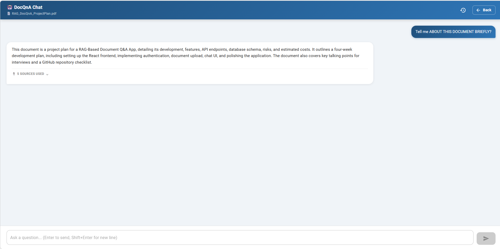
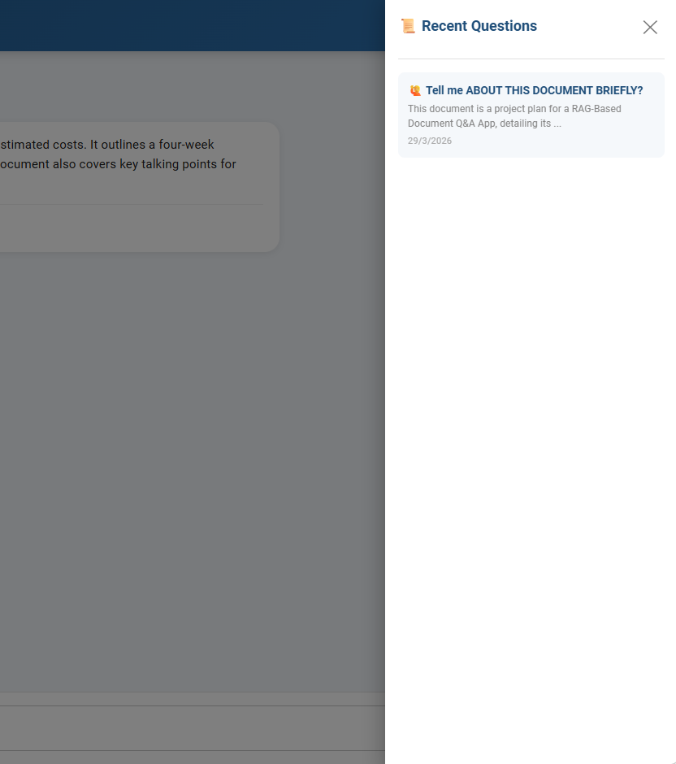
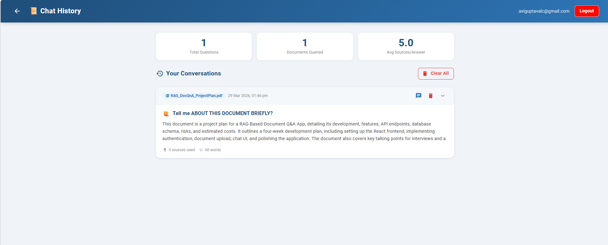
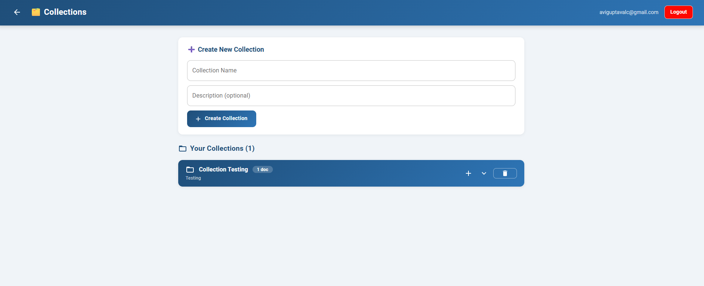
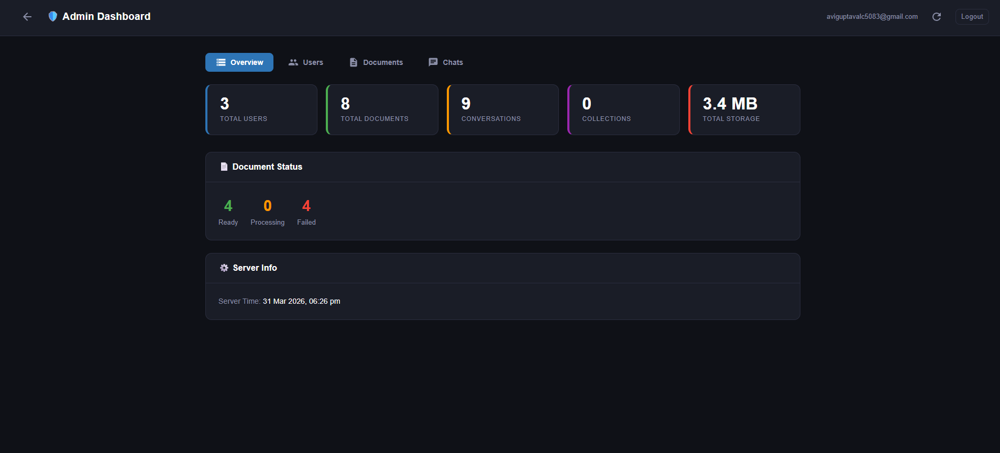

# 🤖 DocQnA — RAG-Based Document Q&A App

> Ask natural language questions over your uploaded PDF documents using AI — powered by Retrieval-Augmented Generation (RAG).


---

## ✨ Features

### ✅ Fully Implemented

- 🔐 **JWT Authentication** — Register, login, logout with refresh token rotation and auto-refresh on expiry
- 📄 **PDF Upload** — Drag and drop with real-time status tracking, non-PDF rejection with clear error messages
- 🧠 **Full RAG Pipeline** — Extract → Chunk → Embed → Store, fully automated in background
- 💬 **AI-Powered Q&A** — Ask natural language questions, get grounded answers from your documents
- 🌊 **Streaming Responses** — Real-time token-by-token answer rendering via Server-Sent Events
- 📚 **Source Attribution** — See exactly which chunks from your document answered the question with relevance scores
- 📜 **Chat History** — Full conversation history with stats, expand/collapse, individual delete and clear all
- 🗂️ **Collections** — Group documents into named collections, add/remove documents, navigate to chat from collection
- 🔒 **User Isolation** — Every user's documents, vectors and history are completely private
- 🍞 **Toast Notifications** — Real-time feedback on every action
- 💀 **Loading Skeletons** — Smooth loading states instead of spinners
- 📱 **Mobile Responsive** — Works on all screen sizes
- 🏥 **Health Check** — `/health` endpoint monitoring PostgreSQL and Qdrant
- 🛡️ **Global Error Handling** — Clean JSON error responses via middleware
- ✅ **FluentValidation** — Request validation on all endpoints

---

## 🖼️ Screenshots

### Login


### Register


### Dashboard — Document Upload & Management


### Chat — AI Q&A with Streaming + Source Attribution



### Chat — AI History



### Chat History with Stats



### Collections Management



### Admin Dashboard



---

## 🌐 Live Demo

|                     | URL                                                                             |
| ------------------- | ------------------------------------------------------------------------------- |
| 🎨 **Frontend**     | [doc-qna-rag-v2pu.vercel.app](https://doc-qna-rag-v2pu.vercel.app/login)        |
| 🔧 **API Swagger**  | [docqna-api.onrender.com/swagger](https://docqna-api.onrender.com/swagger)      |
| 🏥 **Health Check** | [docqna-api.onrender.com/health](https://docqna-api.onrender.com/health)        |
| 🌐 **Demo Video**   | [Recorded Session](https://www.loom.com/share/19e3124276734b27af26eb27f19dacf7) |

> ⚠️ Render free tier spins down after 15 minutes of inactivity.
> First request may take ~30 seconds to wake up.

## 🏗️ Architecture

```
┌─────────────────────────────────────────────────────────┐
│                  React 18 + TypeScript                  │
│     MUI styled() · Zustand · Axios · react-hot-toast   │
└────────────────────────┬────────────────────────────────┘
                         │ HTTP / REST / SSE
┌────────────────────────▼────────────────────────────────┐
│              ASP.NET Core 8 Web API                     │
│   JWT Auth · EF Core · FluentValidation · Serilog      │
│         ExceptionMiddleware · HealthChecks              │
└──────┬──────────────────────────────┬───────────────────┘
       │                              │
┌──────▼──────┐               ┌───────▼────────────────────┐
│  PostgreSQL │               │      RAG Pipeline           │
│  (Metadata) │               │                             │
│  · Users    │               │  PDF → PdfPig → Extract     │
│  · Documents│               │      → Sliding Window Chunk │
│  · Chat     │               │      → NVIDIA NIM Embed     │
│  · History  │               │      → Qdrant Store         │
│  · Collections              │                             │
└─────────────┘               │  Query → Embed → Search     │
                              │        → Llama → Stream     │
                         ┌────▼────┐  ┌───────▼──────┐
                         │ Qdrant  │  │ NVIDIA NIM   │
                         │ Vectors │  │ Llama 4 +    │
                         │  DB     │  │ nv-embedqa   │
                         └─────────┘  └──────────────┘
```

---

## 🛠️ Tech Stack

| Layer          | Technology                                             | Purpose                            |
| -------------- | ------------------------------------------------------ | ---------------------------------- |
| Frontend       | React 18 + TypeScript                                  | UI framework                       |
| Styling        | MUI `styled()` utility                                 | Component styling — no inline sx   |
| State          | Zustand                                                | Global auth state                  |
| HTTP           | Axios + interceptors                                   | API calls, 401 auto-refresh        |
| Notifications  | react-hot-toast                                        | User feedback toasts               |
| Markdown       | react-markdown                                         | Render LLM markdown answers        |
| Backend        | ASP.NET Core 8 Web API                                 | REST + SSE API                     |
| Auth           | JWT Bearer + BCrypt                                    | Secure authentication              |
| Validation     | FluentValidation                                       | Request validation                 |
| ORM            | EF Core 8 + PostgreSQL                                 | Relational data storage            |
| PDF Parsing    | PdfPig                                                 | Text extraction from PDFs          |
| Chunking       | Custom sliding window                                  | 2000-char chunks, 200-char overlap |
| Embeddings     | NVIDIA NIM (`nvidia/nv-embedqa-e5-v5`)                 | 1024-dim vector embeddings         |
| LLM            | NVIDIA NIM (`meta/llama-4-maverick-17b-128e-instruct`) | Answer generation                  |
| Streaming      | Server-Sent Events (SSE)                               | Token-by-token streaming           |
| Vector DB      | Qdrant (gRPC port 6334)                                | Cosine similarity search           |
| Logging        | Serilog                                                | Structured request logging         |
| Health         | ASP.NET Health Checks                                  | PostgreSQL + Qdrant monitoring     |
| Infrastructure | Docker + Docker Compose                                | PostgreSQL + Qdrant containers     |

---

## 🚀 Getting Started

### Prerequisites

| Tool               | Version | Download                                                 |
| ------------------ | ------- | -------------------------------------------------------- |
| Node.js            | 20 LTS  | [nodejs.org](https://nodejs.org)                         |
| .NET SDK           | 8.0     | [dot.net](https://dot.net)                               |
| Docker Desktop     | Latest  | [docker.com](https://docker.com/products/docker-desktop) |
| Git                | Latest  | [git-scm.com](https://git-scm.com)                       |
| NVIDIA NIM API Key | —       | [build.nvidia.com](https://build.nvidia.com)             |

---

### 1. Clone the Repository

```bash
git clone https://github.com/YOUR_USERNAME/doc-qna-rag.git
cd doc-qna-rag
```

### 2. Start Docker Containers

```bash
docker-compose up -d
```

| Service          | Port                     | Dashboard                       |
| ---------------- | ------------------------ | ------------------------------- |
| PostgreSQL 16    | 5432                     | Connect via DBeaver             |
| Qdrant Vector DB | 6333 (REST), 6334 (gRPC) | http://localhost:6333/dashboard |

### 3. Configure the Backend

Create `DocQnA.API/appsettings.Development.json` — **gitignored, never commit:**

```json
{
  "Nvidianim": {
    "ApiKey": "nvapi-your-key-here",
    "BaseUrl": "https://integrate.api.nvidia.com/v1",
    "ChatModel": "meta/llama-4-maverick-17b-128e-instruct",
    "EmbeddingModel": "nvidia/nv-embedqa-e5-v5"
  }
}
```

Verify `appsettings.json`:

```json
{
  "ConnectionStrings": {
    "DefaultConnection": "Host=localhost;Port=5432;Database=docqna_db;Username=docqna_user;Password=docqna_pass123"
  },
  "Jwt": {
    "SecretKey": "your-generated-secret-key",
    "Issuer": "DocQnA",
    "Audience": "DocQnA",
    "ExpiryMinutes": "60"
  },
  "Qdrant": {
    "Endpoint": "http://localhost:6333",
    "VectorSize": 1024
  }
}
```

### 4. Run the Backend

```bash
cd DocQnA.API
dotnet run
```

- Swagger UI → `http://localhost:5000/swagger`
- Health Check → `http://localhost:5000/health`

> EF Core migrations run automatically on startup.

### 5. Run the Frontend

```bash
cd doc-qna-client
npm install
npm run dev
```

App → `http://localhost:5173`

---

## 📁 Project Structure

```
DocQnA/
│
├── DocQnA.API/                        # ASP.NET Core 8 Backend
│   ├── Controllers/
│   │   ├── AuthController.cs          # Register, Login, Refresh, Logout
│   │   ├── DocumentController.cs      # Upload, List, Delete, Status
│   │   ├── QnAController.cs           # Ask, AskStream (SSE), History CRUD
│   │   └── CollectionController.cs    # Collections CRUD + doc management
│   ├── Services/
│   │   ├── AuthService.cs             # JWT auth business logic
│   │   ├── TokenService.cs            # JWT + refresh token generation
│   │   ├── DocumentService.cs         # Upload + Qdrant cleanup on delete
│   │   ├── IngestionService.cs        # RAG pipeline orchestrator
│   │   ├── PdfExtractorService.cs     # PDF → raw text (PdfPig)
│   │   ├── TextChunkerService.cs      # Sliding window chunker
│   │   ├── NimService.cs              # NVIDIA NIM embeddings + LLM + streaming
│   │   ├── QdrantService.cs           # Vector store CRUD (gRPC)
│   │   ├── QnAService.cs              # Q&A + streaming + history
│   │   └── CollectionService.cs       # Collections business logic
│   ├── Models/
│   │   ├── User.cs
│   │   ├── Document.cs
│   │   ├── ChatMessage.cs
│   │   ├── Collection.cs
│   │   └── CollectionDocument.cs      # Join table
│   ├── DTOs/
│   │   ├── AuthDTOs.cs
│   │   ├── DocumentDTOs.cs
│   │   ├── QnADTOs.cs
│   │   └── CollectionDTOs.cs
│   ├── Validators/
│   │   ├── AuthValidators.cs          # FluentValidation rules
│   │   ├── QnAValidators.cs
│   │   └── CollectionValidators.cs
│   ├── Middleware/
│   │   └── ExceptionMiddleware.cs     # Global error handling
│   ├── Infrastructure/
│   │   ├── AppDbContext.cs
│   │   └── Migrations/
│   ├── Extensions/
│   │   └── ClaimsPrincipalExtensions.cs
│   └── Program.cs
│
├── doc-qna-client/                    # React + TypeScript Frontend
│   └── src/
│       ├── pages/
│       │   ├── LoginPage.tsx
│       │   ├── RegisterPage.tsx
│       │   ├── DashboardPage.tsx      # Upload + document management
│       │   ├── ChatPage.tsx           # Streaming chat + history sidebar
│       │   ├── HistoryPage.tsx        # Full history + stats + individual delete
│       │   └── CollectionsPage.tsx    # Collections CRUD
│       ├── components/
│       │   ├── DocumentUploader.tsx   # Drag & drop, PDF-only with rejection toast
│       │   ├── DocumentList.tsx       # List with status chips + chat button
│       │   ├── SourceViewer.tsx       # Collapsible source chunks
│       │   ├── ProtectedRoute.tsx     # JWT-guarded routes
│       │   ├── ErrorBoundary.tsx      # React error boundary
│       │   ├── skeletons/
│       │   │   ├── DocumentSkeleton.tsx
│       │   │   ├── HistorySkeleton.tsx
│       │   │   └── CollectionSkeleton.tsx
│       │   └── styles/
│       │       ├── AuthStyles.ts
│       │       ├── DocumentStyles.ts  # NavPrimaryButton + NavDangerButton
│       │       ├── ChatStyles.ts
│       │       ├── HistoryStyles.ts
│       │       └── CollectionStyles.ts
│       ├── api/
│       │   ├── authApi.ts             # Axios + 401 interceptor + token refresh
│       │   ├── documentApi.ts
│       │   ├── qnaApi.ts              # ask + askStream (SSE) + history CRUD
│       │   └── collectionApi.ts
│       ├── store/
│       │   └── authStore.ts           # Zustand auth state
│       ├── hooks/
│       │   └── usePageTitle.ts        # Dynamic page titles
│       └── types/
│           └── index.ts               # All TypeScript interfaces
│
├── docker-compose.yml
└── README.md
```

---

## 🔌 API Reference

### Auth

| Method | Endpoint             | Auth | Description               |
| ------ | -------------------- | ---- | ------------------------- |
| POST   | `/api/auth/register` | ❌   | Register new user         |
| POST   | `/api/auth/login`    | ❌   | Login, returns JWT tokens |
| POST   | `/api/auth/refresh`  | ❌   | Refresh access token      |
| POST   | `/api/auth/logout`   | ✅   | Invalidate refresh token  |

### Documents

| Method | Endpoint                    | Auth | Description                                |
| ------ | --------------------------- | ---- | ------------------------------------------ |
| POST   | `/api/document/upload`      | ✅   | Upload PDF, triggers RAG pipeline          |
| GET    | `/api/document`             | ✅   | List all user documents                    |
| GET    | `/api/document/{id}`        | ✅   | Get document by ID                         |
| GET    | `/api/document/{id}/status` | ✅   | Check ingestion status                     |
| DELETE | `/api/document/{id}`        | ✅   | Delete doc + Qdrant vectors + chat history |

### Q&A

| Method | Endpoint                | Auth | Description                                 |
| ------ | ----------------------- | ---- | ------------------------------------------- |
| POST   | `/api/qna/ask`          | ✅   | Ask question, returns full answer + sources |
| GET    | `/api/qna/ask-stream`   | ✅   | Streaming answer via SSE (token-by-token)   |
| GET    | `/api/qna/history`      | ✅   | Get chat history (default last 20)          |
| DELETE | `/api/qna/history`      | ✅   | Clear all history                           |
| DELETE | `/api/qna/history/{id}` | ✅   | Delete single conversation                  |

### Collections

| Method | Endpoint                                 | Auth | Description                     |
| ------ | ---------------------------------------- | ---- | ------------------------------- |
| GET    | `/api/collection`                        | ✅   | List all collections            |
| POST   | `/api/collection`                        | ✅   | Create new collection           |
| POST   | `/api/collection/{id}/documents`         | ✅   | Add document to collection      |
| DELETE | `/api/collection/{id}/documents/{docId}` | ✅   | Remove document from collection |
| DELETE | `/api/collection/{id}`                   | ✅   | Delete collection               |

### Health

| Method | Endpoint  | Auth | Description                      |
| ------ | --------- | ---- | -------------------------------- |
| GET    | `/health` | ❌   | Check PostgreSQL + Qdrant status |

---

## 🧠 RAG Pipeline

### Ingestion (runs in background after PDF upload)

```
1. EXTRACT   PdfPig reads all pages → raw text
2. CHUNK     Sliding window → 2000-char chunks, 200-char overlap
3. EMBED     Each chunk → NVIDIA NIM (nv-embedqa-e5-v5) → 1024-dim float vector
4. STORE     Vectors + chunk text stored in Qdrant (one collection per document)
5. READY     Document status updated to "ready" in PostgreSQL
```

### Query (streaming via SSE)

```
1. EMBED     Question → NVIDIA NIM → 1024-dim vector
2. SEARCH    Cosine similarity in Qdrant → top 5 chunks (score threshold: 0.3)
3. SOURCES   Sources sent to frontend immediately via SSE
4. PROMPT    System prompt + context chunks + user question assembled
5. STREAM    Llama via NVIDIA NIM → tokens streamed via SSE
6. DISPLAY   Frontend renders tokens live with blinking cursor
7. SAVE      Full Q&A saved to ChatMessages table
```

---

## 🔐 Security

- `appsettings.Development.json` is gitignored — API keys never committed
- Passwords hashed with BCrypt
- JWT access tokens expire in 60 minutes
- Refresh tokens rotate on every login (7-day expiry)
- 401 responses trigger automatic token refresh in Axios interceptor
- Documents and vectors isolated per user at DB and Qdrant level
- FluentValidation on all request DTOs
- Global exception middleware returns clean JSON (no stack traces in production)

---

## 🐳 Docker

```bash
docker-compose up -d    # start PostgreSQL + Qdrant
docker-compose down     # stop
docker logs docqna_postgres
docker logs docqna_qdrant
```

| Service       | Port                     | Notes                                           |
| ------------- | ------------------------ | ----------------------------------------------- |
| PostgreSQL 16 | 5432                     | User data, documents, chat history, collections |
| Qdrant        | 6333 (REST), 6334 (gRPC) | Vector embeddings, one collection per document  |

---

## 💰 Running Cost: $0

| Service                                    | Cost      |
| ------------------------------------------ | --------- |
| NVIDIA NIM Embeddings (`nv-embedqa-e5-v5`) | Free tier |
| NVIDIA NIM LLM (`llama-4-maverick`)        | Free tier |
| Qdrant (self-hosted Docker)                | Free      |
| PostgreSQL (self-hosted Docker)            | Free      |
| Vercel (frontend hosting)                  | Free      |
| Railway (API hosting)                      | Free tier |
| **Total**                                  | **$0**    |

---

## 🎯 Key Technical Decisions

**Why RAG over fine-tuning?**
RAG is cheaper, keeps answers grounded in the document, and works with any new document without retraining. Fine-tuning bakes knowledge in statically.

**Why NVIDIA NIM over OpenAI?**
NVIDIA NIM offers free tier access to state-of-the-art models (Llama 4, nv-embedqa) with an OpenAI-compatible API. Zero cost for development and demos.

**Why Qdrant over pgvector?**
Qdrant is purpose-built for vector search with gRPC, filtering, and a great dashboard. pgvector is simpler but slower at scale.

**Why SSE over WebSockets for streaming?**
SSE is simpler (HTTP GET, no handshake), natively supported by browsers via `EventSource`, and sufficient for one-way server-to-client streaming.

**Why MUI `styled()` over `sx` prop?**
Styled components keep presentation logic in dedicated files, are reusable across pages, and make the code cleaner and easier to maintain.

---

## 👤 About

Portfolio project by **ABHISHEK NARAYAN GUPTA** — Associate Software Engineer (2.2 years exp)
demonstrating full-stack development with production-grade AI/RAG integration.

**Stack:** `React` · `TypeScript` · `MUI` · `ASP.NET Core 8` · `EF Core` · `FluentValidation` · `NVIDIA NIM` · `Qdrant` · `Docker` · `SSE`

---

## 📄 License

MIT License
